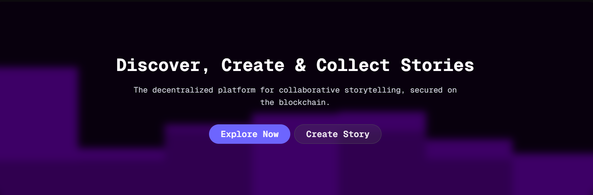

# 📖 TaleCraft: Collaborative Storytelling on Blockchain

**TaleCraft** is a decentralized platform that empowers writers to create, collaborate, and build upon stories in an innovative blockchain-powered ecosystem. By minting stories and chapters as NFTs, the platform enables rich, branching narratives that evolve organically with community contributions.

<p align="center">
  
</p>


-----

## 📚 Table of Contents
## 📑 Table of Contents

- [✨ Features](#features)  
  - [For Creators & Writers](#for-creators--writers)  
  - [For Readers & Community](#for-readers--community)  
- [🚀 Key Features](#key-features)  
- [🛠 Getting Started](#getting-started)  
- [📝 How to Create Your First Story](#how-to-create-your-first-story)  
- [🏗 Project Architecture](#project-architecture)  
- [🔗 Website Pages](#website-pages)  
- [🎯 Core Technologies](#core-technologies)  
- [🤝 Contributing](#contributing)  
- [📄 License](#license)  
- [🗺️ Roadmap](#️roadmap)  
- [📞 Support & Community](#support--community)  

-----

## ✨ Features

### For Creators & Writers

  - **True Ownership**: Every story and chapter is minted as an **NFT**, ensuring you retain permanent ownership and provenance.
  - **Global Collaboration**: Connect with writers worldwide to build epic, multi-authored narratives.
  - **Monetization**: Each contribution is tokenized, creating potential revenue streams for your creative work.
  - **Permanent Archive**: Stories are stored on **IPFS**, ensuring they can never be lost or censored.

### For Readers & Community

  - **Interactive Stories**: Discover and read stories that evolve with community contributions.
  - **Discover New Voices**: Find emerging writers and unique collaborative narratives.
  - **Shape Stories**: Contribute your own chapters to stories you love.
  - **Collect Literature**: Own pieces of collaborative literary history as **NFTs**.

-----

## 🚀 Key Features

### Collaborative Storytelling Engine

  - Create original stories or add chapters to existing narratives.
  - Support for rich HTML content with multimedia elements.
  - **Parent-child story relationships** enabling complex narrative trees.
  - Community-driven story evolution.

### Blockchain & Web3 Integration

#### Origin Protocol SDK

The **Origin Protocol SDK** is the core of our blockchain integration, simplifying complex smart contract interactions. It enables us to:

  - **Mint NFTs**: Automatically create a unique **ERC-721 NFT** for every story and chapter published. The SDK handles the contract interactions, gas estimation, and transaction submission.
  - **Attach Metadata**: Seamlessly link each NFT to its story content and metadata (title, description, author, cover image), which is permanently stored on **IPFS**.
  - **Manage Ownership**: Tracks the ownership of each story and chapter on the blockchain, ensuring creators have full, verifiable control.
  - **Handle Royalties**: The SDK can be configured to manage on-chain royalties and revenue splits, allowing for shared monetization among collaborative authors.
  - **Tokenize Contributions**: By minting each chapter as a separate NFT, we create a transparent and verifiable record of every contributor's work.

### Advanced Technical Stack

  - **Frontend**: Next.js 14 (App Router), React, Tailwind CSS.
  - **Backend**: MongoDB for fast queries, GraphQL for blockchain data.
  - **Storage**: IPFS via Pinata for decentralized file storage.

-----

## 🛠 Getting Started

### Prerequisites

  - Node.js (v18 or higher)
  - npm or yarn package manager
  - MongoDB Atlas account
  - Pinata IPFS account
  - Web3 wallet (MetaMask, etc.)

### Installation

1.  **Clone the repository:**
    ```bash
    git clone https://github.com/your-username/talecraft.git
    cd talecraft
    ```
2.  **Install dependencies:**
    ```bash
    npm install
    # or
    yarn install
    ```
3.  **Environment Setup:**
    Create a `.env.local` file in the root directory:
    ```env
    # Database
    MONGODB_URI=your_mongodb_connection_string

    # IPFS Storage
    PINATA_API_KEY=your_pinata_api_key
    PINATA_SECRET_API_KEY=your_pinata_secret_key

    # Origin Protocol
    ORIGIN_API_KEY=your_origin_protocol_key

    # GraphQL Endpoint
    NEXT_PUBLIC_GRAPHQL_ENDPOINT=your_graphql_endpoint
    ```
4.  **Run the development server:**
    ```bash
    npm run dev
    # or
    yarn dev
    ```
5.  **Open your browser:**
    Navigate to [http://localhost:3000](https://www.google.com/search?q=http://localhost:3000)

-----

## 📝 How to Create Your First Story

### Step 1: Access Story Creation

  - Navigate to the homepage and click the **"Create Story"** button.
  - Connect your Web3 wallet when prompted.

### Step 2: Fill Story Details

  - **Title**: A compelling title.
  - **Description**: A brief summary.
  - **Cover Image**: An eye-catching cover (JPG, PNG, GIF up to 10MB).
  - **Content**: Write your opening chapter using the rich text editor.

### Step 3: Publish to Blockchain

  - Click **"Publish Story"** to confirm the wallet transaction for NFT minting.
  - Wait for the **IPFS** upload and blockchain confirmation.

### Step 4: Success\!

Your story is now:

  - ✅ Stored permanently on **IPFS**.
  - ✅ Minted as an **NFT** in your wallet.
  - ✅ Available for community contributions.
  - ✅ Discoverable on the platform.

-----

## 🏗 Project Architecture

### File Structure
```
talecraft/
├── app/                          # Next.js App Router pages
├── components/                 # Reusable React components
├── lib/                        # Core logic and utilities
├── public/                     # Static assets
└── styles/                     # Global styles
```

### Key Components

  - `IpNftMintButton`: Handles the NFT minting process.
  - `StoryEditor`: Rich text editor for content creation.
  - `StoryCard`: Component for displaying story previews.
  - `ChapterList`: Shows a story's chapters and their relationships.

-----

## 🔗 Website Pages

### Public Pages

  - **Homepage** (`/`) - Platform introduction and featured stories.
  - **Explore Stories** (`/explore`) - Browse and search all stories.
  - **Story Detail** (`/story/[id]`) - Individual story with chapters.

### Creator Pages

  - **Create Story** (`/create`) - Story creation form.
  - **Add Chapter** (`/story/[id]/add-chapter`) - Chapter creation.
  - **My Stories** (`/dashboard`) - Creator's published content.

-----

## 🎯 Core Technologies

### Frontend Stack

  - **Next.js 14**: React framework with App Router.
  - **React 18**: Component-based UI library.
  - **Tailwind CSS**: Utility-first styling.

### Backend & Database

  - **MongoDB**: Document database.
  - **Mongoose**: MongoDB object modeling.
  - **Next.js API Routes**: Serverless API endpoints.
  - **IPFS/Pinata**: Decentralized file storage.

### Blockchain Integration

  - **Origin Protocol SDK**: NFT minting and management.
  - **Viem**: Ethereum library for wallet interactions.
  - **GraphQL**: Blockchain data querying.

-----

## 🤝 Contributing

We welcome contributions from developers, writers, and creators\!

### For Developers

  - Fork the repository and create feature branches.
  - Submit pull requests with clear descriptions.

### For Writers

  - Create high-quality stories and chapters.
  - Provide feedback on user experience.

-----

## 📄 License

This project is licensed under the **MIT License**. See the [LICENSE](https://www.google.com/search?q=LICENSE) file for details.

-----

## 🗺️ Roadmap

### Phase 1: Core Platform **✅**

  - Story creation and chapter addition.
  - NFT minting with Origin Protocol.
  - IPFS content storage.
  - Basic user interface.

### Phase 2: Enhanced Features **🔄**

  - Advanced story discovery and search.
  - Writer reputation and rewards system.
  - Story collection and favorites.

### Phase 3: Community Features **📋**

  - Story voting and curation.
  - Writer collaboration tools.
  - Community governance features.

-----

## 📞 Support & Community

  - **Discord**: [Join our community](https://www.google.com/search?q=https://discord.gg/talecraft)
  - **Twitter**: [@TaleCraft](https://x.com/Aditya45210l)
  - **GitHub**: [Report bugs or request features](https://github.com/aditya45210l)
  - **Email**: aditya45210l@gmail.com

-----

*Built with ❤️ by Aditya*
